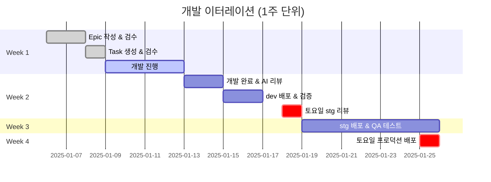
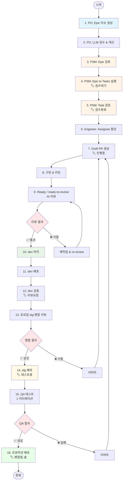
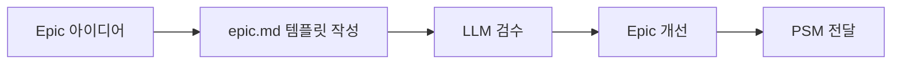
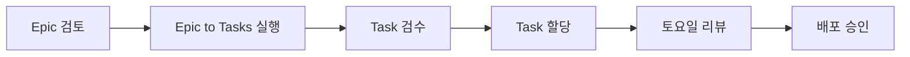
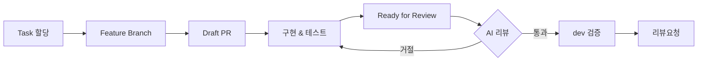
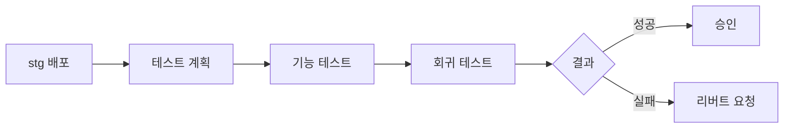
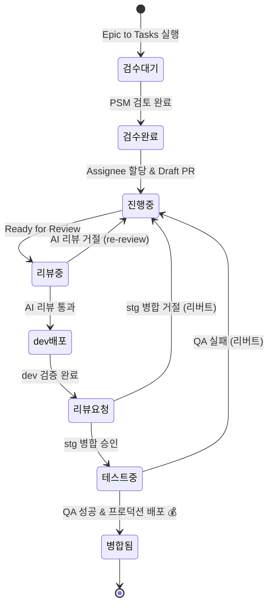

# 🤝 Semicolon 협업 프로세스

> Epic 작성부터 프로덕션 배포까지 전체 개발 워크플로우

---

## 📋 목차

1. [프로세스 개요](#프로세스-개요)
2. [전체 플로우차트](#전체-플로우차트)
3. [Phase별 상세 가이드](#phase별-상세-가이드)
4. [역할별 가이드](#역할별-가이드)
5. [상태 전이도](#상태-전이도)
6. [체크리스트](#체크리스트)

---

## 프로세스 개요

### 🎯 핵심 철학

**"AI 기반 자동화로 품질과 생산성 극대화"**

- ✅ Epic/Bug → AI가 실행 가능한 Task 자동 생성
- ✅ PR 준비 완료 → AI 자동 리뷰 → 승인 시 자동 머지
- ✅ 매주 토요일 정기 배포 (Staging & Production)
- ✅ 이터레이션 단위 작업량 관리 및 보상

### 📅 이터레이션 타임라인



---

## 전체 플로우차트



---

## Phase별 상세 가이드

### Phase 1: Epic 작성 및 검수

#### 1. PO: Epic 이슈 생성
- GitHub Issue → `epic.md` 템플릿 사용
- 필수 포함 항목:
  - 📝 배경 및 목적
  - 👤 사용자 스토리 (3개 이상)
  - ✅ 완료 조건
  - 📦 관련 레포지토리 선택

#### 2. PO: LLM 검수 & 개선
- `.github/prompts/validate-epic-story-structure-conversational.md` 활용
- ChatGPT/Claude와 대화형 검수 진행
- 개선된 Epic으로 이슈 업데이트

#### 3. PSM: Epic 검토
- 사용자 스토리 명확성 확인
- 완료 조건 구체성 검토
- 필요시 PO에게 피드백

---

### Phase 2: Task 생성 및 검수

#### 4. PSM: Epic to Tasks 실행 [🏷️ 검수대기]
- `command-center` 레포 → Actions → "Epic to Tasks Generator"
- 입력:
  - 타겟 레포지토리 선택
  - Epic 이슈 번호 입력
  - `dry_run: true` (처음엔 테스트)
- AI가 실행 가능한 Task 자동 생성:
  - 우선순위 자동 계산
  - 작업량 추정
  - 기술 스택 및 요구사항 명시

#### 5. PSM: Task 검토 [🏷️ 검수완료]
- 생성된 Task 카드 검토
- 보완/수정 필요 시 직접 편집
- 작업량(Estimate) 검증
- Status: `검수대기` → `검수완료` 변경

---

### Phase 3: 개발 및 리뷰

#### 6. Engineer: Assignee 할당
- PSM이 Task 할당
- 엔지니어가 Task 확인

#### 7. Draft PR 생성 [🏷️ 진행중]
```bash
# Feature Branch 생성
git checkout -b feat/issue-123-feature-name

# Draft PR 생성
gh pr create \
  --title "feat: 기능 이름" \
  --body "Closes #123" \
  --base dev \
  --draft
```
- Status: `검수완료` → `진행중`

#### 8. 구현 & 커밋
```bash
# 커밋 규칙 준수
git commit -m "feat: 기능 구현 #123"
git commit -m "test: 테스트 추가 #123"
git push
```

**커밋 규칙:**
- `feat:` 새 기능
- `fix:` 버그 수정
- `refactor:` 리팩토링
- `test:` 테스트 추가
- `docs:` 문서 수정
- 커밋 메시지에 이슈 번호 포함 (#123)

#### 9. Ready for Review → AI 리뷰
**트리거 방법 (3가지):**
1. ⭐ Draft PR → "Ready for review" 버튼 클릭 (권장)
2. `ready-for-review` 라벨 추가
3. `re-review` 라벨 추가 (재리뷰)

**AI 리뷰 항목:**
- 코드 품질 (복잡도, 가독성)
- 테스트 커버리지
- 이슈 요구사항 충족 여부
- 보안 취약점
- 코딩 표준 준수

#### 10. 리뷰 결과
- ✅ **통과**: 자동으로 `dev` 브랜치로 머지
- ❌ **거절**: 수정 필요
  - 지적사항 확인
  - 수정 후 커밋 & 푸시
  - `re-review` 라벨 추가 → 재리뷰

---

### Phase 4: Dev 검증 및 Staging 리뷰

#### 11. dev 머지 → CI/CD → dev 서버 배포
- 자동 배포 (GitHub Actions)
- dev 서버: `dev.semicolon.team`

#### 12. dev 검증 [🏷️ 리뷰요청]
- dev 서버에서 기능 검증
- 추가 수정 필요 시 7-11 반복
- 검증 완료 시 Status: `진행중` → `리뷰요청`

#### 13. 토요일 stg 병합 리뷰
**매주 토요일 정기 리뷰:**
- PSM들이 온콜 라이브 리뷰 진행
- 리뷰 일정 사전 공지
- 담당자 온라인 참석 권장 (참석 안 하면 해명 기회 없음)

**리뷰 항목:**
- dev 검증 결과
- 코드 품질
- 요구사항 충족 여부
- 배포 리스크

**결과:**
- ✅ **승인**: `dev` → `stg` 머지
- ❌ **거절**: 리버트 커밋 생성 → 7-13 반복

---

### Phase 5: QA 및 프로덕션 배포

#### 14. stg 머지 → CI/CD → 스테이지 서버 배포 [🏷️ 테스트중]
- 자동 배포 (GitHub Actions)
- stg 서버: `stg.semicolon.team`
- Status: `리뷰요청` → `테스트중`

#### 15. QA 테스트 (1 이터레이션)
- QA 팀이 1주간 스테이지 서버 테스트
- 테스트 항목:
  - 기능 동작 확인
  - 회귀 테스트
  - 크로스 브라우저 테스트
  - 모바일 테스트

**QA 결과:**
- ✅ **성공**: 프로덕션 배포 대기
- ❌ **실패**: 리버트 커밋 생성 → 7-15 반복

#### 16. 토요일 프로덕션 배포 [🏷️ 병합됨 💰]
**매주 토요일 stg 리뷰 직전 배포:**
- `stg` → `main` 머지
- 프로덕션 서버 배포
- Status: `테스트중` → `병합됨`
- **💰 보수 지급**

---

## 역할별 가이드

### 👤 PO (Product Owner)

**담당자**: NO-Y-R

**주요 역할:**
- Epic 작성 및 검수
- 비즈니스 요구사항 정의
- 우선순위 결정

**워크플로우:**


**체크리스트:**
- [ ] Epic 템플릿 모든 섹션 작성
- [ ] 사용자 스토리 3개 이상
- [ ] 완료 조건 명확히 정의
- [ ] 관련 레포지토리 선택
- [ ] LLM 검수 완료

---

### 👥 PSM (Product Scrum Master)

**담당자**: reus-jeon, garden92

**주요 역할:**
- Epic 검토 및 Task 생성
- Task 검수 및 할당
- 토요일 병합 리뷰 진행

**워크플로우:**


**체크리스트:**
- [ ] Epic 사용자 스토리 검증
- [ ] Epic to Tasks dry_run 테스트
- [ ] 생성된 Task 검토 및 수정
- [ ] 작업량(Estimate) 검증
- [ ] Task Assignee 할당
- [ ] 토요일 리뷰 일정 공지
- [ ] 온콜 리뷰 진행
- [ ] 배포 승인/거절 결정

---

### 💻 Engineer (Developer)

**담당자**: 정규직, 파트타이머

**주요 역할:**
- 할당된 Task 구현
- 테스트 작성
- dev 검증

**워크플로우:**


**체크리스트:**
- [ ] Task 요구사항 이해
- [ ] Feature Branch 생성
- [ ] Draft PR 생성
- [ ] 로컬 테스트 완료 (lint, test)
- [ ] 커밋 규칙 준수
- [ ] 이슈 번호 커밋 메시지 포함
- [ ] Ready for Review 전환
- [ ] AI 리뷰 통과
- [ ] dev 서버 검증
- [ ] 토요일 리뷰 대비

---

### 🧪 QA (Quality Assurance)

**주요 역할:**
- 스테이지 서버 테스트
- 회귀 테스트
- 배포 승인/거절

**워크플로우:**


**체크리스트:**
- [ ] 테스트 계획 작성
- [ ] 기능 동작 확인
- [ ] 회귀 테스트 실행
- [ ] 크로스 브라우저 테스트
- [ ] 모바일 테스트
- [ ] 이슈 발견 시 버그 리포트 작성
- [ ] 최종 승인/거절 결정

---

## 상태 전이도



---

## 체크리스트

### 📝 Epic 작성 체크리스트 (PO)

```markdown
- [ ] Epic 템플릿 사용 (epic.md)
- [ ] 배경 및 목적 작성
- [ ] 사용자 스토리 3개 이상 작성
- [ ] 완료 조건 명확히 정의
- [ ] 관련 레포지토리 선택
- [ ] LLM 검수 완료 (validate-epic-story-structure-conversational.md)
- [ ] Epic 이슈 생성
- [ ] PSM에게 검토 요청
```

### 🔍 Epic 검토 체크리스트 (PSM)

```markdown
- [ ] 사용자 스토리 명확성 확인
- [ ] 완료 조건 구체성 검토
- [ ] 관련 레포지토리 적절성 확인
- [ ] Epic to Tasks 실행 (dry_run=true)
- [ ] 생성된 Task 검토
- [ ] Task 작업량 검증
- [ ] Task 보완/수정
- [ ] Status: 검수대기 → 검수완료
- [ ] Task Assignee 할당
```

### 💻 개발 체크리스트 (Engineer)

```markdown
- [ ] Task 요구사항 이해
- [ ] Feature Branch 생성 (feat/issue-123-name)
- [ ] Draft PR 생성 (Closes #123)
- [ ] Status: 검수완료 → 진행중
- [ ] 기능 구현
- [ ] 테스트 작성
- [ ] 로컬 lint 통과 (npm run lint)
- [ ] 로컬 test 통과 (npm run test)
- [ ] 커밋 규칙 준수
- [ ] 이슈 번호 포함 (#123)
- [ ] console.log 제거
- [ ] Ready for Review 전환 또는 ready-for-review 라벨
- [ ] AI 리뷰 통과 확인
- [ ] dev 서버 검증
- [ ] Status: 진행중 → 리뷰요청
```

### 🧪 QA 체크리스트

```markdown
- [ ] 테스트 계획 수립
- [ ] 기능 동작 확인
- [ ] 회귀 테스트 실행
- [ ] 크로스 브라우저 테스트 (Chrome, Safari, Firefox)
- [ ] 모바일 테스트 (iOS, Android)
- [ ] 성능 테스트
- [ ] 버그 발견 시 리포트 작성
- [ ] 최종 승인/거절 결정
```

---

## 💡 자주 묻는 질문 (FAQ)

### Q1. Draft PR을 일반 PR로 전환하지 않고 커밋만 했는데 AI 리뷰가 안 돼요
**A**: Ready for Review로 전환하거나 `ready-for-review` 라벨을 추가해야 AI 리뷰가 트리거됩니다.

### Q2. AI 리뷰에서 거절당했어요. 어떻게 해야 하나요?
**A**:
1. 지적사항 확인
2. 수정 후 커밋 & 푸시
3. `re-review` 라벨 추가
4. AI 재리뷰 자동 실행

### Q3. 토요일 stg 리뷰에 참석하지 못하면 어떻게 되나요?
**A**: 참석하지 않아도 리뷰는 진행되지만, 병합 거절 시 해명 기회가 없습니다. 가능한 한 참석하는 것이 좋습니다.

### Q4. Epic to Tasks 실행 시 Task가 너무 많이 생성됐어요
**A**: PSM이 검토 단계에서 불필요한 Task를 삭제하거나 병합할 수 있습니다.

### Q5. QA 테스트 중 버그가 발견되면 어떻게 되나요?
**A**:
1. 해당 기능 리버트 커밋 생성
2. stg에서 롤백
3. 버그 수정 후 7-15 단계 반복
4. 다음 이터레이션에 재배포

---

## 📞 문의 및 지원

- **PO 관련**: NO-Y-R
- **PSM 관련**: reus-jeon, garden92
- **기술 문의**: Tech Lead
- **프로세스 개선 제안**: GitHub Issues

---

_Last Updated: 2025-10-16_
