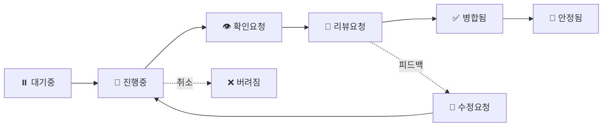

# 협업 가이드

효과적인 팀 협업을 위한 GitHub Projects 활용법과 프로세스 가이드입니다.

## 📊 GitHub Projects 활용

### 이슈관리 프로젝트 보드 (#1)

Semicolon DevTeam의 전체적인 업무 이슈를 관리하기 위한 통합 프로젝트 보드입니다.
- **프로젝트 URL**: [https://github.com/orgs/semicolon-devteam/projects/1](https://github.com/orgs/semicolon-devteam/projects/1)
- **총 관리 이슈**: 300개+ (활발히 운영 중)
- **필드 수**: 21개의 맞춤 필드로 세분화된 관리

### Status 필드 (작업 단계)



#### ⏸️ **대기중**
- 아직 시작하지 않은 작업
- 우선순위 설정 대기 또는 블로킹 이슈 대기
- 다음 단계: 진행중으로 이동

#### 🔄 **진행중**
- 현재 활발히 작업 중인 이슈
- 담당자가 실제 작업 시작
- **WIP 제한**: 개인당 최대 2개
- 다음 단계: 확인요청 또는 리뷰요청

#### 👁️ **확인요청**
- 작업을 위해 매니저의 확인이 필요한 상태
- 작업 병목 또는 협업 필요
- 다음 단계: 진행중 또는 리뷰요청

#### 📝 **리뷰요청**
- PR 리뷰가 필요한 상태
- PR 생성 및 리뷰어 지정 완료
- 다음 단계: 병합됨 또는 수정요청

#### 🔧 **수정요청**
- 리뷰 후 수정이 필요한 상태
- 리뷰 피드백 받음
- 다음 단계: 진행중 또는 리뷰요청

#### ✅ **병합됨**
- PR이 메인 브랜치에 병합된 상태
- PR 머지 완료
- 다음 단계: 안정됨 또는 대기중(문제 발생 시)

#### 🎯 **안정됨**
- 프로덕션에 배포되어 안정화된 상태
- 배포 완료 및 모니터링 통과

#### ❌ **버려짐**
- 취소되거나 보류된 이슈
- 더 이상 진행하지 않기로 결정

### 프로젝트 접근 및 사용

1. **프로젝트 보드 접근**
   ```bash
   # CLI로 프로젝트 보드 확인
   gh project view 1 --owner semicolon-devteam

   # 웹에서 접근
   # https://github.com/orgs/semicolon-devteam/projects/1
   ```

2. **이슈 생성 및 추가**
   ```bash
   # 레포지토리에서 이슈 생성
   gh issue create --repo semicolon-devteam/[repo-name] \
     --title "이슈 제목" \
     --body "이슈 내용" \
     --project 1

   # 기존 이슈를 프로젝트에 추가
   gh project item-add 1 --owner semicolon-devteam --url [issue-url]
   ```

3. **필터 활용**
   ```bash
   # 진행중인 이슈 조회
   gh project item-list 1 --owner semicolon-devteam \
     --format json | jq '.items[] | select(.status == "진행중")'

   # P0 긴급 이슈 조회  
   gh project item-list 1 --owner semicolon-devteam \
     --format json | jq '.items[] | select(.priority == "P0(긴급)")'
   ```

## 🎯 이슈 관리

### 이슈 생성 가이드라인

#### 제목 작성 규칙
```
[타입] 명확한 작업 설명
```

**타입 예시:**
- `[Feature]` 새로운 기능
- `[Bug]` 버그 수정
- `[Refactor]` 코드 개선
- `[Docs]` 문서 작업
- `[Test]` 테스트 추가
- `[Chore]` 기타 작업

#### 이슈 본문 구조
```markdown
## 📋 설명
무엇을 해야 하는지 명확히 설명

## 🎯 수락 기준
- [ ] 기준 1
- [ ] 기준 2
- [ ] 기준 3

## 🔗 관련 자료
- 참고 문서나 디자인
- 관련 이슈: #123

## 📝 추가 정보
기타 필요한 컨텍스트
```

### 우선순위 체계

#### 🔴 P0(긴급)
- **기준**: 서비스 장애, 보안 이슈, 데이터 손실 위험
- **대응**: 즉시 처리, 모든 작업 중단
- **목표 해결 시간**: ASAP

#### 🟠 P1(높음)
- **기준**: 핵심 기능 버그, 주요 고객 이슈
- **대응**: 당일 또는 익일 처리
- **목표 해결 시간**: 1이터레이션 (1주)

#### 🟡 P2(보통)
- **기준**: 일반 기능 개선, 일반 버그
- **대응**: 현재 이터레이션 내 처리
- **목표 해결 시간**: 4이터레이션

#### 🟢 P3(낮음)
- **기준**: 마이너 개선사항, UX 개선
- **대응**: 다음 이터레이션 고려
- **목표 해결 시간**: 8이터레이션

#### ⚪ P4(매우 낮음)
- **기준**: nice-to-have 기능, 장기 개선사항
- **대응**: 백로그 관리
- **목표 해결 시간**: 분기별 검토

### 맞춤 필드 활용

#### 📅 이터레이션 관리
- **주간 스프린트**: 매주 월요일 시작, 7일 단위
- **명명 규칙**: "[월] [주차]/[전체주차]"
- **예시**: "9월 1/4", "10월 2/5"

#### 💼 기술영역 분류
- **기획**: 요구사항 정의, 스펙 작성
- **디자인**: UI/UX 디자인, 프로토타입
- **프론트**: React, Vue 등 클라이언트 개발
- **백엔드**: API, 서버, 데이터베이스
- **인프라**: DevOps, 배포, 모니터링

#### 📦 레포카테고리
- **Core**: 핵심 서비스 레포지토리
- **Microservice**: 마이크로서비스 레포지토리
- **Community**: 커뮤니티 관련 레포지토리
- **Management**: 관리/운영 도구
- **Infrastructure**: 인프라 및 설정 레포지토리

#### 💰 비용영향 평가
- **없음**: 추가 비용 발생 없음
- **낮음**: 월 10만원 미만
- **중간**: 월 10-50만원
- **높음**: 월 50만원 이상

#### 🤝 의사결정 레벨
- **불필요**: 담당자 재량으로 진행
- **담당자 승인**: 팀 리드 승인 필요
- **경영진 논의**: 경영진 회의 안건
- **경영진 승인**: 경영진 최종 승인 필요

#### 🎨 디자인 상태
- **불필요**: 디자인 작업 불필요
- **임의 진행**: 개발자 재량으로 UI 구성
- **아이디어**: 컨셉 단계
- **와이어프레임**: 구조 설계 완료
- **시안**: 디자인 시안 작업 중
- **승인대기**: 디자인 리뷰 대기
- **완료**: 디자인 확정

#### 📊 날짜 필드 관리
- **시작일**: 실제 작업 시작일
- **목표일**: 완료 목표일 (데드라인)
- **종료일**: 실제 완료일 (회고용)

#### ⚖️ 작업량 추정
- 스토리 포인트 또는 시간 단위로 입력
- 1포인트 = 약 4시간 작업
- 복잡도에 따라 1, 2, 3, 5, 8, 13 포인트 할당

## 📝 이슈 템플릿

### 이슈 템플릿 디렉토리 구조

프로젝트 루트에 다음 구조로 템플릿을 생성하세요:

```
.github/
├── ISSUE_TEMPLATE/
│   ├── bug_report.md
│   ├── feature_request.md
│   ├── refactor.md
│   └── config.yml
├── PULL_REQUEST_TEMPLATE.md
└── workflows/
    └── project-automation.yml
```

### 템플릿 파일 예시

#### 1. Bug Report (`.github/ISSUE_TEMPLATE/bug_report.md`)

```markdown
---
name: 버그 리포트
about: 버그를 신고하여 제품 개선에 기여하세요
title: '[Bug] '
labels: bug, needs-triage
assignees: ''
---

## 🐛 버그 설명
버그에 대한 명확하고 간결한 설명

## 🔄 재현 방법
1. '...'로 이동
2. '...' 클릭
3. '...' 스크롤
4. 오류 발생

## ✅ 예상 동작
정상적으로 동작했을 때 예상되는 결과

## 📸 스크린샷
가능하다면 스크린샷을 첨부하세요

## 💻 환경
- OS: [예: macOS 14.0]
- Browser: [예: Chrome 116]
- Version: [예: v2.0.1]

## 📝 추가 정보
문제 해결에 도움이 될 수 있는 추가 정보
```

#### 2. Feature Request (`.github/ISSUE_TEMPLATE/feature_request.md`)

```markdown
---
name: 기능 제안
about: 프로젝트 개선을 위한 아이디어 제안
title: '[Feature] '
labels: enhancement, needs-discussion
assignees: ''
---

## 💡 기능 설명
제안하는 기능에 대한 명확한 설명

## 🎯 해결하려는 문제
이 기능이 해결하려는 문제나 니즈

## 🔍 제안 솔루션
원하는 해결 방법에 대한 설명

## 🤔 대안
고려해본 다른 대안들

## 📊 예상 효과
- 사용자 경험 개선
- 성능 향상
- 기타 이점

## 🔗 참고 자료
관련 문서, 디자인, 경쟁 제품 등
```

#### 3. Refactor Request (`.github/ISSUE_TEMPLATE/refactor.md`)

```markdown
---
name: 리팩토링
about: 코드 개선 및 기술 부채 해결
title: '[Refactor] '
labels: refactor, technical-debt
assignees: ''
---

## 🔧 리팩토링 대상
개선이 필요한 코드나 시스템 부분

## 📍 현재 문제점
- 문제점 1
- 문제점 2

## ✨ 개선 방안
제안하는 개선 방법

## 📈 예상 효과
- 코드 가독성 향상
- 성능 개선
- 유지보수성 향상

## ⚠️ 리스크
잠재적인 위험이나 고려사항

## 📋 체크리스트
- [ ] 테스트 코드 작성
- [ ] 문서 업데이트
- [ ] 성능 측정
```

#### 4. 설정 파일 (`.github/ISSUE_TEMPLATE/config.yml`)

```yaml
blank_issues_enabled: false
contact_links:
  - name: 💬 Discussions
    url: https://github.com/semicolon-devteam/docs/discussions
    about: 일반적인 질문이나 토론
  - name: 📚 Documentation
    url: https://semicolon-devteam.github.io/docs
    about: 문서를 먼저 확인하세요
  - name: 💬 Slack
    url: https://semicolon-team.slack.com
    about: 실시간 도움이 필요한 경우
```

## 🔄 Pull Request 프로세스

### PR 템플릿 (`.github/PULL_REQUEST_TEMPLATE.md`)

```markdown
## 📋 개요
이 PR이 해결하는 이슈나 구현하는 기능 설명

## 🔗 관련 이슈
Closes #(이슈 번호)

## 📝 변경사항
- 주요 변경 1
- 주요 변경 2
- 주요 변경 3

## 🧪 테스트
- [ ] 유닛 테스트 통과
- [ ] 통합 테스트 통과
- [ ] 로컬 환경 테스트
- [ ] 성능 영향 확인

## 📸 스크린샷 (UI 변경 시)
변경 전 | 변경 후
---|---
이미지 | 이미지

## 🚀 배포 고려사항
- [ ] 데이터베이스 마이그레이션 필요
- [ ] 환경 변수 추가 필요
- [ ] 다운타임 발생 가능성
- [ ] 롤백 계획 수립

## ✅ 체크리스트
- [ ] 코드 스타일 가이드라인 준수
- [ ] 셀프 리뷰 완료
- [ ] 문서 업데이트
- [ ] 변경 로그 작성
```

### PR 리뷰 프로세스

1. **자동 체크**
   - CI/CD 파이프라인 통과
   - 코드 커버리지 확인
   - 린트 검사 통과

2. **리뷰어 지정**
   - 최소 1명 이상의 리뷰 필수
   - 도메인 전문가 우선 지정

3. **리뷰 가이드라인**
   ```markdown
   # 리뷰 코멘트 형식
   [필수] 반드시 수정 필요
   [제안] 개선하면 좋을 사항
   [질문] 설명이 필요한 부분
   [참고] 정보 공유
   ```

## 🔄 워크플로우 자동화

### GitHub Actions 자동화 (`.github/workflows/project-automation.yml`)

```yaml
name: Project Automation

on:
  issues:
    types: [opened, labeled]
  pull_request:
    types: [opened, ready_for_review, closed]

jobs:
  project-automation:
    runs-on: ubuntu-latest
    steps:
      - name: Add to project
        uses: actions/add-to-project@v0.5.0
        with:
          project-url: https://github.com/orgs/semicolon-devteam/projects/1
          github-token: ${{ secrets.PROJECT_TOKEN }}
      
      - name: Move based on label
        if: github.event.label.name == 'ready'
        uses: alex-page/github-project-automation-plus@v0.8.3
        with:
          project: Team Board
          column: Ready
          repo-token: ${{ secrets.GITHUB_TOKEN }}
```

## 📈 이터레이션 운영

### 주간 이터레이션 사이클 (1주 단위)

우리 팀은 매주 월요일 시작하는 1주 단위 이터레이션으로 운영됩니다.

```
월요일: 이터레이션 계획 회의 (오전 10시)
화-목: 개발 집중 기간
금요일: 회고 및 다음 주 준비 (오후 4시)
```

### 일일 체크리스트

1. **매일 아침**:
   - 진행중 이슈 상태 확인
   - 우선순위 P0, P1 이슈 체크
   - 이터레이션 목표 확인

2. **작업 전환 시**:
   - Status 필드 즉시 업데이트
   - 블로커 발생 시 코멘트 작성
   - 작업량 필드 업데이트

3. **일일 종료 시**:
   - 진행 상황 코멘트 업데이트
   - 다음날 계획 수립
   - 목표일 대비 진행률 체크

### 일일 스탠드업
- **시간**: 매일 오전 10시
- **형식**: 15분 이내
- **내용**:
  - 어제 한 일
  - 오늘 할 일
  - 블로커 공유

### 주간 회고
매주 금요일 오후 진행되는 회고에서 이터레이션 성과를 검토합니다.

## 📊 성과 측정

### 주요 메트릭
- **Lead Time**: 대기중 → 안정됨까지 전체 소요 시간
- **Cycle Time**: 진행중 → 병합됨까지 개발 시간
- **우선순위 준수율**: P0, P1 이슈의 목표일 달성률
- **이터레이션 완성도**: 계획 대비 완료 이슈 비율
- **기술영역별 처리량**: 팀별 주간 완료 이슈 수

### 대시보드 활용
- GitHub Insights로 진행 상황 모니터링
- Projects 대시보드에서 Status별 그룹화로 칸반 보드 구성
- 우선순위별 정렬로 중요 이슈 우선 확인
- 이터레이션별 필터로 스프린트 관리

## 🎯 Best Practices

### 팀 운영 규칙

#### 작업 규칙
1. **WIP 제한**: 개인당 "진행중" 상태 최대 2개
2. **우선순위 준수**: P0 > P1 > P2 순서로 작업
3. **일일 업데이트**: 진행중 이슈는 매일 상태 업데이트
4. **이터레이션 계획 준수**: 계획된 이슈 우선 처리

#### 리뷰 규칙
1. **리뷰 SLA**:
   - P0: 2시간 이내
   - P1: 당일 내
   - P2-P4: 익일 내
2. **리뷰어 지정**: PR 생성 시 반드시 리뷰어 지정
3. **승인 기준**: 최소 1명 이상 승인 필요

#### Do's ✅
- Status 필드 즉시 업데이트
- 우선순위에 따른 작업 진행
- 일일 체크리스트 준수
- 블로커 즉시 공유
- 목표일 설정 및 준수

#### Don'ts ❌
- WIP 한도 초과 (개인당 2개)
- 이슈 없이 작업 진행
- Status 업데이트 누락
- 리뷰 없이 머지
- 우선순위 무시

## 🛠️ 유용한 명령어 모음

### 프로젝트 조회
```bash
# 프로젝트 상세 정보
gh project view 1 --owner semicolon-devteam

# 프로젝트 필드 목록
gh project field-list 1 --owner semicolon-devteam

# 프로젝트 아이템 목록
gh project item-list 1 --owner semicolon-devteam --limit 50
```

### 이슈 관리
```bash
# 이슈를 프로젝트에 추가하고 필드 설정
gh project item-add 1 --owner semicolon-devteam \
  --url [issue-url]

# 이슈 상태 변경
gh project item-edit --project-id 1 --id [item-id] \
  --field-id [field-id] --single-select-option-id [option-id]

# 자주 사용하는 명령 단축키 등록
gh alias set my-issues 'project item-list 1 --owner semicolon-devteam --limit 20'
```

## 🔗 관련 링크

- [이슈관리 프로젝트 보드](https://github.com/orgs/semicolon-devteam/projects/1)
- [사업관리 프로젝트 보드](https://github.com/orgs/semicolon-devteam/projects/6)  
- [GitHub Projects v2 API 문서](https://docs.github.com/en/graphql/reference/objects#projectv2)
- [GitHub CLI 프로젝트 명령어](https://cli.github.com/manual/gh_project)
- [효과적인 PR 작성법](https://github.blog/2015-01-21-how-to-write-the-perfect-pull-request/)

---

다음 단계: [개발 가이드](/docs/development/) →