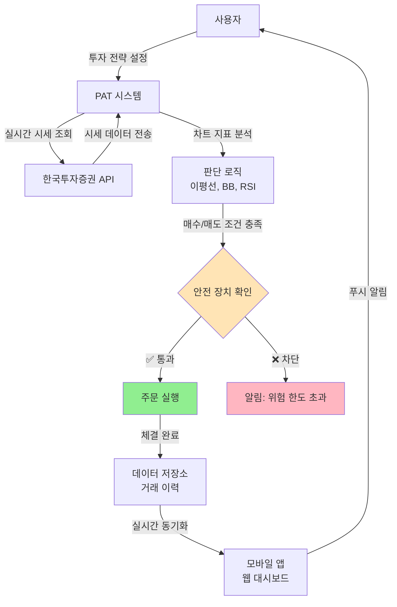
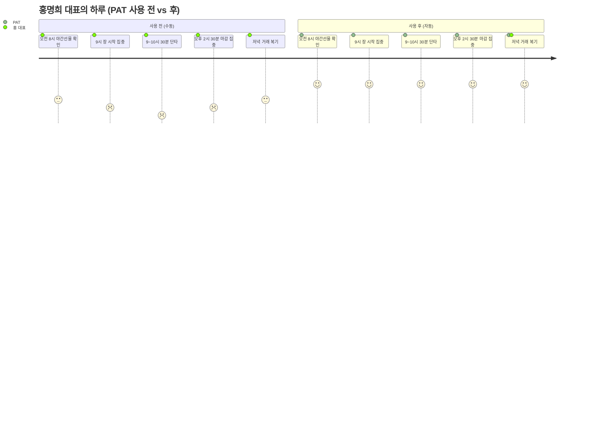

# PAT (Personal Auto Trader) — CONSTITUTION v3.0

> 프로젝트 헌법 (불변 원칙 & 제약사항)  
> 작성일: 2026-03-30  
> 작성자: PlanClaw, Reus  
> **Phase 0 목표:** 일반 대중이 이해할 수 있는 "시스템 작동 원리" 정의

---

## PART A: 프로젝트 정체성

### 우리가 만드는 것
**PAT는 투자 피로도를 없애는 자동매매 비서입니다.**

매일 아침 8시부터 장 마감까지 차트를 들여다보는 것은 정신적으로나 육체적으로 소진됩니다. PAT는 당신의 투자 전략과 판단 기준을 학습하여, 당신이 직접 하는 것과 똑같은 방식으로 자동 매매를 수행합니다.

### 첫 사용자
**홍명희 대표**
- 20년 경력 개인투자자
- 매일 8시 야간선물 확인 → 9시 장 시작 → 오후 2시 30분 집중 모니터링
- **Pain Point:** "투자는 좋아하지만, 하루 종일 차트만 볼 수는 없다"

### MVP 목표
- **출시일:** 2026년 4월 30일
- **핵심 기능:**
  1. 투자 루틴 학습 및 자동 재현
  2. 실시간 시장 모니터링
  3. 자동 주문 실행 및 위험 관리
- **성공 기준:** 홍 대표가 직접 매매할 때와 동일한 수익률 달성

---

## PART B: 시스템 작동 원리 (How It Works)

### 하루의 흐름

```
🌅 오전 8시
└─ PAT가 자동으로 야간선물 지수를 확인합니다
   - 선물 지수가 정상 범위(5300~5900)인가?
   - 해외 주요 지수(다우, 나스닥) 동향은?
   - 주요 경제 뉴스 요약 (네이버 금융)

📈 오전 9시 (장 시작)
└─ 사용자가 설정한 전략에 따라 매수 후보를 준비합니다
   - 동시호가 확인
   - 차트 지표(이평선, 볼린저밴드, RSI) 분석
   - 조건 충족 시 자동 매수 주문

⚡ 오전 9시 ~ 10시 30분 (변동성 활용)
└─ 실시간 차트를 모니터링하며 자동 매매
   - 단타: 목표 수익률 도달 시 자동 매도
   - 물타기: 하락 시 평단가 낮추기 (설정된 한도 내)
   - 손절: 손실 한도 초과 시 자동 청산

📱 실시간 알림
└─ 주요 거래 발생 시 모바일 푸시 알림
   - "삼성전자 100주 매수 체결 (72,500원)"
   - "현재 수익률 +2.3% (목표 수익률 3%까지 0.7% 남음)"

🌆 오후 2시 30분 ~ 마감
└─ 장 마감 전 집중 모니터링
   - 포지션 정리 여부 자동 판단
   - 익일 전략 사전 설정

📊 저녁 리포트
└─ 오늘의 거래 요약
   - 총 매수/매도 횟수
   - 실현 손익 / 평가 손익
   - 주요 매매 타이밍 복기
```

### 핵심 기능 (비기술적 설명)

#### 1. 투자 루틴 학습 및 재현
사용자가 평소 매매하는 패턴을 설정합니다. 예를 들어 "주가가 많이 떨어지고, 차트 하단 밴드에 닿았을 때 매수"처럼 자신만의 규칙을 정의할 수 있습니다. PAT는 이 규칙을 24시간 지켜보다가 조건이 맞으면 자동으로 주문을 실행합니다.

#### 2. 실시간 시장 모니터링
증권사 API를 통해 1초 단위로 시세를 확인합니다. 사용자가 관심 종목으로 등록한 주식만 집중 모니터링하므로, 불필요한 정보에 시간을 뺏기지 않습니다.

#### 3. 자동 주문 실행 및 위험 관리
설정된 조건 충족 시 실제 증권 계좌로 주문을 전송합니다. 주문 전 안전 장치를 확인하여, 1회 최대 주문 금액 초과나 일일 손실 한도 초과 시 자동으로 차단합니다. 또한 손실이 설정된 한도를 넘으면 자동으로 포지션을 정리하고, 목표 수익률 도달 시 자동 매도로 이익을 확정합니다.

#### 4. 모바일 알림 및 대시보드
스마트폰으로 거래 체결 알림을 받습니다. 웹 대시보드에서 실시간 수익률과 포지션 현황을 확인할 수 있으며, 외출 중에도 시장 상황을 한눈에 파악할 수 있습니다.

---

## 시각적 다이어그램

### 시스템 플로우 (High-Level)



### 사용자 여정 (User Journey)



---

## PART C: 불변 제약사항 (Non-Negotiable)

### 인프라 (확정)
- **클라우드**: 세미콜론 클라우드 서버 (OCI, 서울 리전)
- **자동 배포**: GitHub Actions → OCI Kubernetes
- **데이터 저장소**: PostgreSQL (Supabase, 팀 공용)
- **도메인**: *.semi-colon.space
- **컨테이너**: GitHub Container Registry
- **증권사 API**: 한국투자증권 Open API (REST/WebSocket)

> ⚠️ **구체적 기능 구현(API 연동, 크롤링, 프론트엔드, 백엔드)은 WorkClaw에게 인계합니다.**  
> Phase 0에서는 "어떤 기술을 쓸 것인가"가 아니라 "시스템이 어떻게 작동하는가"만 정의합니다.

### 보안 원칙
1. **통신**: HTTPS 필수 (모든 API 통신 암호화)
2. **인증**: 로그인 시 안전한 인증 코드 발급 (Supabase Auth)
3. **API 키 보관**: 증권사 API 키는 암호화하여 데이터베이스에 저장
   - 복호화 키는 안전한 환경 변수 저장소에만 보관 (코드에 포함 금지)
4. **자동매매 안전장치**:
   - 1회 최대 주문 금액 제한 (사용자별 설정)
   - 일일 손실 한도 초과 시 자동 정지
   - 비정상 거래 감지 (1분 내 10회 이상 주문 차단)
5. **2단계 인증**: 대량 주문 또는 계좌 설정 변경 시 필수

### 법적 준수
| 법령 | 준수 사항 |
|------|----------|
| **자본시장법** | 시세 조종 금지, 불공정거래 방지 |
| **개인정보 보호법** | 증권사 API 키, 계좌번호 암호화 저장 |
| **전자금융거래법** | 사용자 동의 없이 제3자 제공 금지 |

### 예산 및 일정
- **월 인프라 비용 상한**: 제약 없음 (세미콜론 OCI 공용)
- **MVP 출시 목표**: 2026년 4월 30일
- **Phase 8 완료 (WorkClaw 인계)**: 2026년 4월 15일

### 접근성 및 성능 (사용자 경험)
- **지원 디바이스**: 모바일 우선 (iOS 15+, Android 12+), 웹 지원
- **로딩 속도**: 페이지 로딩 2.5초 이내
- **실시간 시세 업데이트**: 500ms 이내 지연
- **주문 체결 알림**: 1초 이내 모바일 푸시

---

## 핵심 투자 루틴 (첫 사용자: 홍명희 대표)

> ⚠️ 이 섹션은 **Phase 1 (Discovery)**에서 상세화됩니다.  
> 현재는 프로젝트 맥락 이해를 위한 초안입니다.

### 매매 시간대
1. **오전 8시:** 넥스트 거래 주도주 동향 확인
2. **오전 9시 ~ 10시 30분:** 주요 매매 시간 (변동성 활용)
   - 동시호가 확인 후 단타/물타기
3. **오후 2시 30분 ~ 마감:** 장 집중 모니터링

### 필수 확인 지표
- **선물 상하방 지수:** min 5300 / max 5900
- **차트 지표:** 이평선, 볼린저밴드, RSI, 매수/매도 시그널
- **야간선물:** esignal.co.kr 실시간 연동
- **경제 이슈:** 네이버 금융 크롤링 → 요약 제공

---

## WorkClaw 인계 사항

| 카테고리 | 인계 내용 | 비고 |
|----------|-----------|------|
| **증권사 API 연동** | 한국투자증권 REST/WebSocket 구현 | Phase 6 Technical Plan에서 상세화 |
| **차트 지표 계산** | 이평선, 볼린저밴드, RSI, MACD 로직 | 라이브러리 선택은 WorkClaw 판단 |
| **야간선물 크롤링** | esignal.co.kr Puppeteer 구현 | API 대안 우선 검토 |
| **프론트엔드** | React 기반 대시보드 + 모바일 앱 | 프레임워크 선택은 WorkClaw 판단 |
| **백엔드** | Node.js 기반 매매 로직 서버 | NestJS 권장, 최종 결정은 WorkClaw |

---

## 변경 이력

| 날짜 | 버전 | 변경 내용 | 작성자 |
|------|------|-----------|--------|
| 2026-03-29 | v1.0 | 초안 작성 | PlanClaw |
| 2026-03-30 | v2.0 | Best Practices 기반 재작성 | PlanClaw |
| 2026-03-30 | v3.0 | greenfield-planner 스킬 개선 반영<br/>- 3-Part 구조 적용<br/>- 비기술적 언어 전면 사용<br/>- Mermaid 다이어그램 추가<br/>- WorkClaw 인계 항목 명시 | PlanClaw |

---

**승인 필요:** 기술 리더 (Reus)  
**승인 여부:** [ ] 승인 / [ ] 수정 요청
